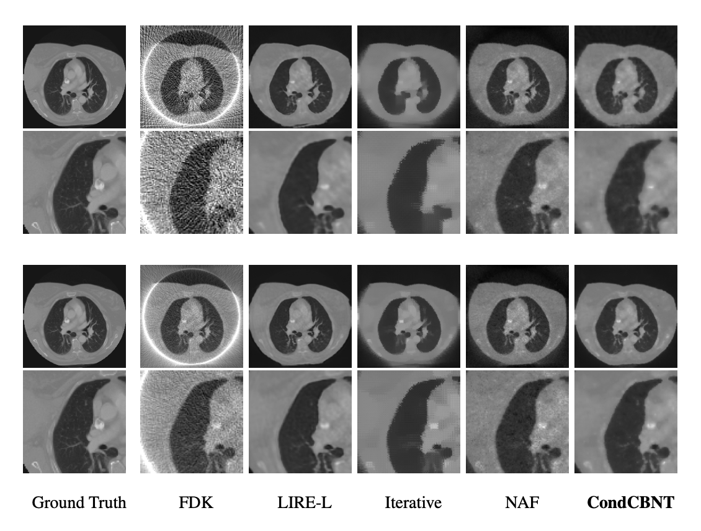

*Conventional Computed Tomography (CT) methods require large numbers of noise-free projections for accurate density reconstructions, limiting their applicability to the more complex class of Cone Beam Geometry CT (CBCT) reconstruction. We propose a novel conditioning method where local modulations are modeled per patient as a field over the input domain through a Neural Modulation Field (NMF). The resulting Conditional Cone Beam Neural Tomography (CondCBNT) shows improved performance for both high and low numbers of available projections on noise-free and noisy data.*

  

Samuele Papa, David M Knigge, Riccardo Valperga, Nikita Moriakov, Miltos Kofinas, Jan-Jakob Sonke, Efstratios Gavves

